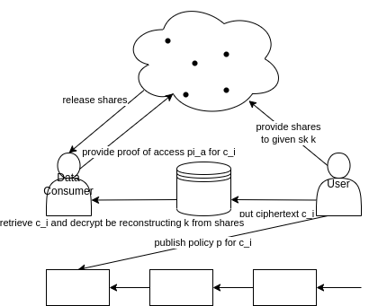

# Proseminar Data Sovereignty

## Meeting 18.01.24 16:30

- Hauptproblem Aktuell. Kein Verständnis für selbst gewähltes Thema
- Notlösung anderes Thema: Anonymous Access
    -> Frage: How can Data Consumers remain anonymous during "authenticate" and "access"?
    -> Ausarbeitung andhand Calypso und Droplet

- ## Abstract
- ## Introduction

- ## Understanding Decentralised Access Control

    For users of the modern web, granting service providers access to protected resources is a common practice and is often required to even use certain web services.
    A system offering access control essentially enables users to disclose resources owned by them for usage by the requesting web service.
    The desired attributes of Access Control systems include granularity in the access scope and revocability of access at any time by the user.

    - ### Access Control in Web 2.0

        A web service (client) requesting access to an access-restricted resource hosted on a resource server can access the resource by using the resource owner's credentials.
        Using this method to grant access comes with several issues.
        First, the resource owner has no option but the update his credentials if he wants to revoke the granted access.
        Second, by disclosing the credentials to the resource server, the client gets access to all resources hosted on that server and third, the compromisation of that client results in a compromisation of the resource owner's credentials and therefore all of the resources of the user hosted on the resource server.

        To address those problems, the OAuth protocol specifies an authorization flow describing how clients can request access and how resource owners can satisfy this request without having to disclose their credentials which is also easy to revoke.

        - #### OAuth

            The protocol introduces four roles:
                
            - resource owner
            - resource server
            - client
            - authorization server

            The client requests access to a resource on the resource server owned by the resource.
            The resource owner authenticates itself by the authorization server and authorizes the authorization server to issue an access token to the client granting access to the requested resource.
            The client can request the resource from the resource server using the access token.
            The resource server validates the access token and serves the resource if the token is valid.

            OAuth 2.0 as an authorization standard indeed solves the problems with naive access granting but still leaves the user with the burden of trusting the authorization and resource server to comply with the OAuth specification, protect the resources effectively, and consequently enforce the authorization of clients.
            This trust indeed is questionable considering the findings of recent studies, that more than half of the examined mobile applications incorrectly implemented the OAuth 2.0 flow thus making the application vulnerable.

    - ### Decentralized Access Contol

        With the upcoming popularity of IoT devices especially in the realm of wearables and sensors on and around humans, highly privacy-relevant data is generated on a large scale.
        Data-centric centralized industry practices assume that the service provider is part of the user's trusted domain and therefore no effort is made to ensure data confidentiality, allowing for uncontrolled sharing or selling of this highly personal data by service providers.
        These industry practices have led to attempts to control data privacy via privacy regulations that introduced the challenge of ensuring that service providers follow accordingly.

        Shortcomings in privacy have led to a call for a paradigm shift towards a user-centric approach both in technical and non-technical communities.

        #### Definition

        Decentralized Access Control enables data owners to verifiably share data with data consumers by specifying fine-grained access policies without exposing the data in clear to any third party and without the need to rely on any trusted intermediate.
        The primary goal of the concept of decentralized access control is to bring back the power over the data to the data owners by treating data privacy as a first-class citizen.
        
        #### Model

        The model of decentralized access control is described as follows:

        - Storage: The location where the encrypted data units are stored.
        The Storage can be local, a centralized, or a decentralized storage provider.
        - Access Controler: Computational Nodes, granting access to a ciphertext by releasing the according secret shares to the requesting data consumer after validation of the proof of policy satisfaction provided by the data consumer.
        - access policies: Policies specified by the user describing under which conditions a data consumer can access the secret shares of a specific ciphertext.
        - distributed ledger: A technology maintaining a globally verifiable, append-only distributed log of transactions. A popular example is the blockchain technology.

        

        Fig. 1 illustrates the steps required to share user data with a data consumer using the decentralized access control model.

        For a given secret k, she computes a set of shares that gets sent to a committee of access controllers.
        
        Using this secret k for a data item that is desirable to grant access to, the data item is encrypted and stored in the user's wallet or another storage system, and an access policy is published on-chain specifying under which conditions a data consumer is authorized to access the data item.

        A data consumer wishing to access the data item is required to supply proof to the committee of access controllers, stating that the data consumer fulfills the access policy.

        After validating the supplied proof from the data consumer the committee of access controllers releases the secret shares of the secret key k that was used for the encryption of the data item, the data consumer has proved to have access to.

        Using the shares and the ciphertext of the data item, the data consumer can successfully decipher it by reconstructing the secret k.

        An Update to the access policy only requires the user to publish a new access policy to the distributed ledger.

        #### Additional Properties

        - Data Confidentiality
        - Anonymity
        - Auditability
        - Policy Confidentiality
        - Fair Access
        - Access Revocation

    ### Decentralized Access Control with the Example of Calypso

- ## Anonymity vs Auditabilty. Compatible?
    
    ## Why is it desirable to stay anonymous
    ## Key Blinding
    ## Auditability

- ## Link to Data Sovereignty

## Meeting 14.12.23 16:30

### Fragen

- gibt es ein tex template für die Ausarbeitung?

### Guiding Questions

- How can Access Policies be Stored Confidentially On-Chain?
    - CALYPSO - Private Data Management for Decentralized Ledgers

### Thesis Outline

- introduce the challenges of data sovereignty in the modern web
- introduce the goal of the paper
- locate decentralized access control in the layered data sovereignty framework and explain its role and how it interacts with the other layers
- provide an overview of decentralized access control by explaining
    - what purpose does it serve
    - how does it achieve this purpose
        - explain the procedure of specifying access policies
        - explain the access flow of data consumers to data of a user
- Main Guiding Question
    - 

## Meeting 30.12.23 16:00

## topics of interest
- expressive and confidential access policies
- Auditability of access

## Questions
- what are the public parameters `pp`?
- what exactly are the shares `(k_i)^AC`?
- how can the key `k` be reconstructed from only one share `(k_i)^AC`?
- how can anonymity during access and authentication be asserted when the user should be able to verify that access to its data is policy compliant?
- what is "fair access"?

### Unclear Formulations
-  federated protocols
- On-chain policies can govern decentralized access management through transaction-based authentication of users
- [...] retain privacy when presenting their personal data
- anonymous credentials

- authenticate without predicate psi
